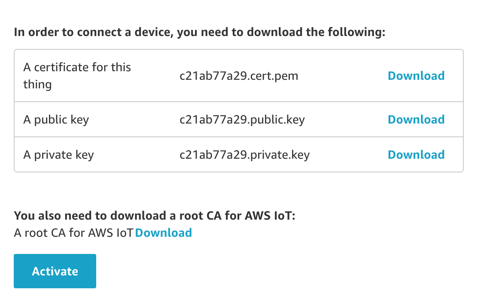

# Garage Door Sensor Firmware
---

This project contains the firmware for the Garage Door IoT sensor, currently running on an ESP8266 chip.

## Quick Start

Follow the instructions in the [setup.md file]('docs/setup.md') in order to ensure your machine can communicate with the MCU. There after: 

  1. Clone the repo - development branch
  2. Create the branch you need to work on (see Git workflow below)
  3. Ensure you have the requisite certs from AWS IoT core for the device you're working on. See section on AWS certs.
  4. Compile the code using the Arduino IDE

## AWS Certificates
### Dev

This project uses AWS IoT Core as an MQTT message broker, IoT fleet management console and dashboard. AWS requires each individual device (called a *Thing* in AWS parlance) to have unique SSL certs. For development, these can be acquired by the following steps: 

  1. Navigate to AWS IoT Core on the console - ensure region is **Ireland (eu-west-1)** (dev region).
  2. Go to the *Manage* tab and click *Create*, and create a single thing (this is for dev)
  3. The name of the thing will be it's UID, for dev it's ok to use a name with convention: `SensorXXDev` where XX is some identifier. Eg: `SensorJPDev`.
  4. Add the sensor to the type **GDoorSensor**, and to the **Development** group
  5. Then 'Next' - no need for searchable attributes at this stage
  6. **Certificates** (the important bit):
      * Choose: One-click certificate creation
      * You will then be taken to a page as displayed below where you will be able to download 3 files:
          * Thing certificate: *.pem.crt file
          * Public key:        *.pem.key file
          * Private key:       *.pem.key file
      * A standard AWS Root CA is also required, this can be reused from the secrets dir (need to affirm this though)
      * Copy the template file [AWSIoTSecrets.h](docs/templates/AWSIoTSecrets.h) from `docs/templates/AWSIoTSecrets.h` to `secrets/AWSIoTSecrets.h`. Do not remove the template file from it's place.
      * Follow the instructions in the file, filling in the necessary hashs in the areas provided with the downloaded certs + keys.
      * Ensure your certificate and key files **ARE NOT** committed to the repo on any branch
  7. **Policy**: This is AWS terminology for what permissions this device has. We require the device to be able to interface with AWS IoT Core. There is already a Dev policy setup: *GDoorDev*

### Prod

In production the above 'signing' process needs to be automated to distribute at scale. 
Further research is required on how this can be achieved.

## Setting the Environment

Development will be carried out on different boards and in different contexts, hence it's imperative to maintain the correct config settings in modular files, as well as set the environment accordingly when you start work. (Most critically when we deploy!)

  1. Open the `Configuration.h` dir --> src/config/
  2. Change the ENV macro appropriately for your work, options:
      * PROD - production-ready firmware
      * DEV - development board with associated dev schematic [Chip = Wroom02]
      * NODE_DEV - Firmware being written on NodeMCU board (pinouts different from above)

## Git Workflow
---

 * Master = Production ready code
 * Development = Staging / Testing
 * New code:
     * Features: branch onto feature/descriptor branch, e.g. *feature/ota-updates*
     * Bug fixes: branch onto bug-fix/descriptor e.g. *bug-fix/connection-timeout*
     * Refactors: branch onto refactor/descriptor, as above 
     * On completion open a Pull Request for it to be merged into development.
  * Use lowercase and kebab-case

## Firmware functionality
---

### WiFi
#### Sequential process

The high level requirement is such that on first run, a sensor will not have WiFi creds stored and will need to acquire them from the SenseSir mobile app. After cred acquisition, it will attempt to connect to the specified network. 

#### Reconnection event

Important to note that the Arduino ESP8266 WiFi library automatically attempts to reconnect on network dropouts. The only action taken by the firmware is to display the reconnecting state (flashing LEDs in req colour).

### MQTT
#### Architecture & Abstraction

The client MQTT implementation utilizes an external library written by [knolleary](https://github.com/knolleary/pubsubclient), this in turn is built on top of the extensive [WiFiClient](https://github.com/esp8266/Arduino/tree/master/libraries/ESP8266WiFi) library. So there are multipl levels of abstraction for the code functionality, most of which are OSS, meaning there is no guarantee of performance. As a result, debugging may require some deep level digging and modification. 

**General Structure:**

  * T1: `SensorMQTT` class, inherits from superclass: `PubSubClient`
      * T2: `PubSubClient` handles MQTT protocol, implements connection, publish, subscribe etc. Is built on top of general `Client.h`, which I'm fairly certain in our case leverages the `WiFiSecureClient` class.
          * T3: `WiFiSecureClient` handles secure sockect connections (SSL).

#### Connection issues

Given the heavy payload of certificates and keys, authentication during connection can give issues in poor network conditions. The issue lies at the T3 layer (see above), wherein T2 calls a blocking connection function on T3. The details of this issue are well documented in an open [issue](https://github.com/sensesir/sensor-firmware/issues/2). 

The firmware seems to be stable after the addition of a reconnection process. Will continue to monitor.

#### Messaging Structure

General topic structure: `targetType/targetUID/firmwareVersion/messageType/descriptor`

  1. Target types:
      1.1 server 
      1.2 gdoor (sensor)
  2. Target UIDs:
      2.1 Server: Dev = eu-west-1.dev
      2.2 Sensors: uuid-v4 generated, eg: b33eeb9c-dc19-4842-92cb-95a6189c30a1
  3. Firmware version: 3-level semantic versioning, e.g. 1.3.0 (to ensure protocol compatiability)
  4. Message type: 
      4.1 event
      4.2 command
  5. Descriptor: the event or command, e.g. Event = reconnect or Command = actuate

For a full list of all topics used see the Google doc.

#### Database shadow

AWS IoT core provides off the shelf *device shadows*, which are a virtual representation of the devices state (usefull in cases of network dropouts for re-synching), but this project takes manual control and represents device state & data in an AWS DynamoDB table. 

### GPIO / Hardware
#### Pin setting by ENV

The pin utilisation may vary between environments, provision has been made for this via the different ENV configurations. The pin constants should be changed in the relevant config file as needed: PROD, DEV, NODE_DEV.

#### LED states

There are 6 discrete network states that need to be represented by an RGB LED. There are as follows: 

  1. State 000: AP mode unconnected | LED: Flashing yellow
  2. State 001: AP connected    | LED: Solid yellow
  3. State 010: WiFi connecting | LED: Flashing white
  4. State 011: WiFi connected  | LED: Solid white
  5. State 100: MQTT connecting | LED: Solid purple *
  6. State 101: MQTT connected  | LED: Solid blue

* State 011 should by common UX employ a transient indicator (flashing light), but the external library is a blocking function, hence this couldn't be done except by using interrupts - which is not worth the potential issues it may cause with an already sensative auth process. 

#### Singleton Pattern

The `GDoorIO` class is implemented as a singleton - a class that can only be instantiated once, all subsequent calls to the constructor will return the unique object. There is *a lot* of caution against this design pattern in many communities, but if implemented correctly (i.e. guarding against memory leaks) and for the appropriate use-case, it is effective and efficient. 

In this scenario it is appropriate because it acts to represent the physical state, and manioulate said state, of the sensor - if which **there can only be one** (hence the singleton). It remove the need to pass around a pointer to the single correct object. 

That said, the pattern can easily be misused, hence before modifying any code related to handling the memory alloc/instantiation of the class, a comprehensive understanding of the pattern and implementation in C++ should be acquired. 

#### Noise filtering

The `GDoorIO` class is responsible for sensing door state. This updated on each loop iteration. In the method `updateDoorState()`, it samples the Reed switch position 10x in 0.5s, this is to assert with a high degree of confidence that the Reed switch's signal is consistence and true. This is inline with fail safe procedure - open is a 'less safe' state than closed. 

The simplicity of the application doesn't necessitate any true DSP at this stage. 

### Error handling

TODO

### OTA updates

TODO

